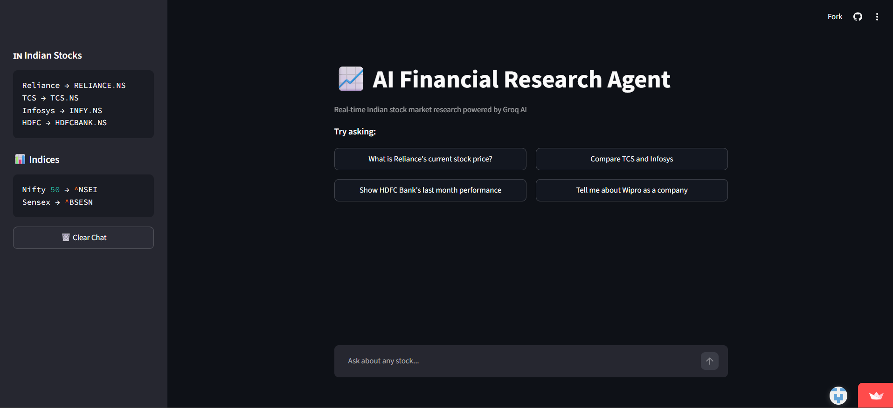
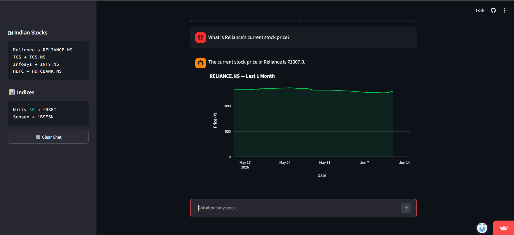

# AI Financial Research Agent

A conversational AI agent for real-time Indian stock market research, powered by **Groq (Llama 3.3 70B)** with tool-calling, **yfinance** for live market data, and an interactive **Streamlit** UI with **Plotly** charts.

🔗 **Live Demo:** https://its-me-navs-ai-financial-research-agent-app-mffxih.streamlit.app/

---

## Features

- **Conversational stock research** — ask natural-language questions like *"What is Reliance's current stock price?"* or *"Compare TCS and Infosys"*
- **Tool-calling agent** — Llama 3.3 70B decides when to fetch live price data, historical data, or company fundamentals via function calling
- **Real-time data** via `yfinance` — current price, 52-week high/low, market cap, volume, P/E ratio, sector, and more
- **Auto-rendered price charts** — when a stock is mentioned, a 1-month price chart is plotted automatically using Plotly
- **Indian stock ticker mapping** — common names (Reliance, TCS, Infosys, HDFC, etc.) auto-resolve to NSE tickers (`.NS`)
- **Multi-turn chat** with conversation history maintained across the session

---

## Screenshots

| Chat Interface | Stock Chart |
|---|---|
|  |  |

---

## Tech Stack

- **LLM:** Groq API — Llama 3.3 70B Versatile (function/tool calling)
- **Frontend:** Streamlit
- **Visualization:** Plotly
- **Market Data:** yfinance
- **Language:** Python

---

## Project Structure

```
.
├── app.py                      # Streamlit UI and chat interface
├── backend/
│   ├── agents/
│   │   └── stock_agent.py      # Agent loop with Groq tool-calling
│   └── tools/
│       └── stock_tools.py      # Stock price, history, and company info tools
├── configs/
│   └── settings.py              # Ticker mappings and config
├── requirements.txt
└── README.md
```

---

## How It Works

1. User asks a question in the chat (e.g., *"How is HDFC Bank performing?"*)
2. The query is sent to **Llama 3.3 70B** via Groq, along with a system prompt and a set of available tools
3. The model decides whether it needs live data and calls one of:
   - `get_stock_price` — current price, change %, market cap, 52-week range
   - `get_historical_data` — OHLCV data for a given period
   - `get_company_info` — sector, industry, P/E, dividend yield, business summary
4. Tool results are fed back to the model, which generates a final natural-language response
5. If a recognized stock is mentioned, Streamlit renders a **1-month price chart** alongside the response

---

## Getting Started

### 1. Clone the repository
```bash
git clone https://github.com/its-me-navs/AI_Financial_Research_Agent.git
cd AI_Financial_Research_Agent
```

### 2. Install dependencies
```bash
pip install -r requirements.txt
```

### 3. Set up environment variables
Create a `.env` file in the root directory:
```
GROQ_API_KEY=your_groq_api_key_here
```

### 4. Run the app
```bash
streamlit run app.py
```

---

## Example Queries

- "What is Reliance's current stock price?"
- "Compare TCS and Infosys"
- "Show HDFC Bank's last month performance"
- "Tell me about Wipro as a company"
- "What's the PE ratio of ICICI Bank?"

---

## Future Improvements

- Add support for portfolio tracking and watchlists
- Multi-stock comparison charts
- News sentiment integration for queried stocks
- Support for additional time periods and technical indicators (RSI, moving averages)